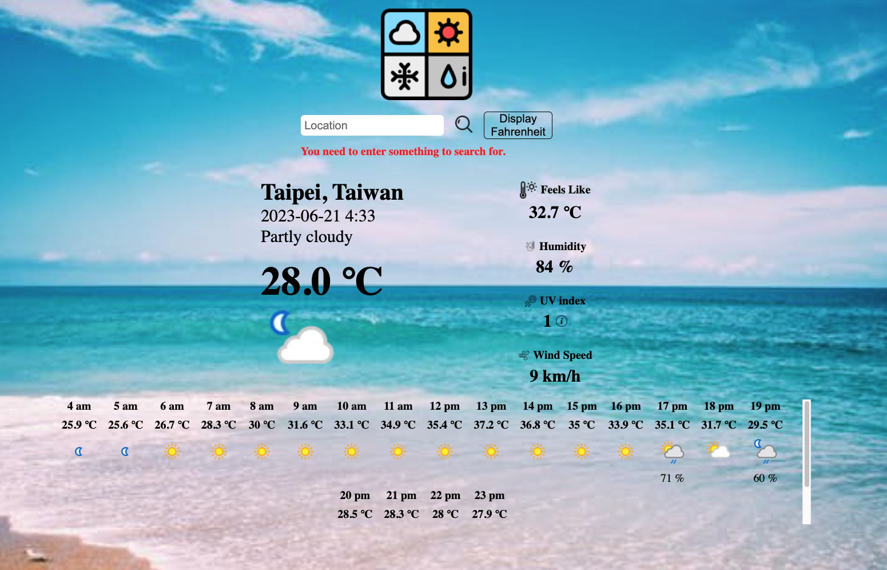

# Weather App

This is a weather forecast application using weather API. In this application, you can search for a specific location for current and hourly weather information and be able to toggle displaying the data in Fahrenheit or Celsius.

## Table of Contents

- Demo
- Technologies Used
- Features
- Credits

## Demo

Check out the [**live**](https://elsiechen.github.io/WeatherApp/) demo.

## Technologies Used

- HTML
- CSS
- JavaScript
- Weather API

## Features

- Fetch data with asynchronous JavaScript using fetch API.
- Toggle displaying the data in Fahrenheit or Celsius.This allows users to choose their preferred unit of measurement and improves accessibility.
- Display different warning information based on data for uv index while hovering over the info image. This provides helpful information and improves the user experience.
- Form validation with JavaScript using constraint validation API to ensure that user input meets the required criteria. 

## Credits

- [Weather API](https://www.weatherapi.com/docs/)
- The Odin Project: [Todo List](https://www.theodinproject.com/lessons/node-path-javascript-weather-app#assignment)
- Icons: [ICONS8](https://icons8.com/icons/set/three-dots-symbol)
